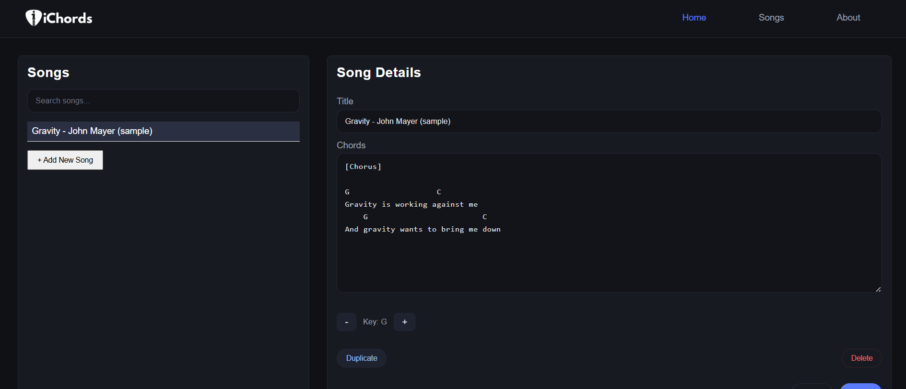

<p align="center">
  
</p>


**iChords** is a simple CRUD web application I built for managing song chords.

It allows users to add, view, edit, delete, and duplicate songs, and includes a chord transposer that detects chords in a song and transposes them to a desired key. Deployed in Render.

---

## What's in it?
- Create, read, update, and delete songs
- Duplicate existing songs
- Detect chords automatically within lyrics
- Transpose chords to any key
- Persistent storage with SQLite

---

## Page & Screenshot  

### **Home**


---

## Tech Stacks I used  

**Frontend:**  
<p>  </p>

**Backend:** 
<p>  </p>

**Database:** 
<p>  </p>

---

## How to use?
### **1. Clone the repository**
```
git clone https://github.com/credough/ichords.git
cd ichords
```
### **2. Create a virtual environment**
```
python -m venv venv
source venv/bin/activate   # Windows: venv\Scripts\activate
```
### **3. Install dependencies**
```
pip install -r requirements.txt
```
### **4. Run the app** 
```
flask run
```
### **Open your browser at:** 
```
http://127.0.0.1:5000
```

🔗 Live Demo: https://ichord.onrender.com

## Future Improvements
- Support for slash chords (e.g., C/G, D/F#)
- Mobile-responsive design
- User authentication
- Song categories or playlists
- Export songs as PDF or text files
